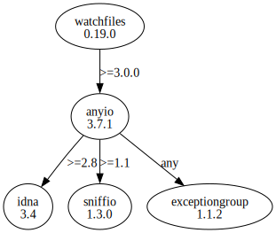

# Third Party Dependencies

<!--[[[fill sbom_sha256()]]]-->
The [SBOM in CycloneDX v1.4 JSON format](https://git.sr.ht/~sthagen/sammen/blob/default/etc/sbom/cdx.json) with SHA256 checksum ([5c171d26 ...](https://git.sr.ht/~sthagen/sammen/blob/default/etc/sbom/cdx.json.sha256 "sha256:5c171d26689d540532901418686a51419bcb3a7fba9f678592e527f7038d11b5")).
<!--[[[end]]] (checksum: 5726233b794f4cd9ba2cf92ac72fdcfd)-->
## Licenses 

JSON files with complete license info of: [direct dependencies](direct-dependency-licenses.json) | [all dependencies](all-dependency-licenses.json)

### Direct Dependencies

<!--[[[fill direct_dependencies_table()]]]-->
| Name                                                                | Version                                               | License     | Author                           | Description (from packaging data)                                            |
|:--------------------------------------------------------------------|:------------------------------------------------------|:------------|:---------------------------------|:-----------------------------------------------------------------------------|
| [watchfiles](https://github.com/samuelcolvin/watchfiles/watchfiles) | [0.21.0](https://pypi.org/project/watchfiles/0.21.0/) | MIT License | Samuel Colvin <s@muelcolvin.com> | Simple, modern and high performance file watching and code reload in python. |
<!--[[[end]]] (checksum: 166335c3803761d831aeb100a53ddf30)-->

### Indirect Dependencies

<!--[[[fill indirect_dependencies_table()]]]-->
| Name                                                                                | Version                                                 | License                              | Author                                   | Description (from packaging data)                                                   |
|:------------------------------------------------------------------------------------|:--------------------------------------------------------|:-------------------------------------|:-----------------------------------------|:------------------------------------------------------------------------------------|
| [anyio](https://anyio.readthedocs.io/en/stable/versionhistory.html)                 | [3.7.1](https://pypi.org/project/anyio/3.7.1/)          | MIT License                          | Alex Grönholm <alex.gronholm@nextday.fi> | High level compatibility layer for multiple asynchronous event loop implementations |
| [exceptiongroup](https://github.com/agronholm/exceptiongroup/blob/main/CHANGES.rst) | [1.1.2](https://pypi.org/project/exceptiongroup/1.1.2/) | MIT License                          | Alex Grönholm <alex.gronholm@nextday.fi> | Backport of PEP 654 (exception groups)                                              |
| [idna](https://github.com/kjd/idna)                                                 | [3.4](https://pypi.org/project/idna/3.4/)               | BSD License                          | Kim Davies <kim@cynosure.com.au>         | Internationalized Domain Names in Applications (IDNA)                               |
| [sniffio](https://github.com/python-trio/sniffio)                                   | [1.3.0](https://pypi.org/project/sniffio/1.3.0/)        | Apache Software License; MIT License | Nathaniel J. Smith                       | Sniff out which async library your code is running under                            |
<!--[[[end]]] (checksum: c000539d11efaa000492d9405a789c2f)-->

## Dependency Tree(s)

JSON file with the complete package dependency tree info of: [the full dependency tree](package-dependency-tree.json)

### Rendered SVG

Base graphviz file in dot format: [Trees of the direct dependencies](package-dependency-tree.dot.txt)



### Console Representation

<!--[[[fill dependency_tree_console_text()]]]-->
````console
watchfiles==0.21.0
└── anyio [required: >=3.0.0, installed: 3.7.1]
    ├── exceptiongroup [required: Any, installed: 1.1.2]
    ├── idna [required: >=2.8, installed: 3.4]
    └── sniffio [required: >=1.1, installed: 1.3.0]
````
<!--[[[end]]] (checksum: 0be38c728bfdfafc40c865b676674fb8)-->
