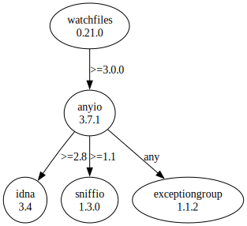

# Third Party Dependencies

<!--[[[fill sbom_sha256()]]]-->
The [SBOM in CycloneDX v1.4 JSON format](https://github.com/sthagen/pilli/blob/default/sbom.json) with SHA256 checksum ([1286a551 ...](https://raw.githubusercontent.com/sthagen/pilli/default/sbom.json.sha256 "sha256:1286a5518a1c98b530822cda88e36d5b721c8ae4cfddd322e85ecf4f0a3ee71d")).
<!--[[[end]]] (checksum: 2c3da32b7a5750abd688cd240aa6760b)-->
## Licenses 

JSON files with complete license info of: [direct dependencies](direct-dependency-licenses.json) | [all dependencies](all-dependency-licenses.json)

### Direct Dependencies

<!--[[[fill direct_dependencies_table()]]]-->
| Name                                                                | Version                                               | License     | Author  | Description (from packaging data)                                            |
|:--------------------------------------------------------------------|:------------------------------------------------------|:------------|:--------|:-----------------------------------------------------------------------------|
| [watchfiles](https://github.com/samuelcolvin/watchfiles/watchfiles) | [0.18.1](https://pypi.org/project/watchfiles/0.18.1/) | MIT License | UNKNOWN | Simple, modern and high performance file watching and code reload in python. |
<!--[[[end]]] (checksum: 2970dbc7c43b89a7b0109c7f795e2758)-->

### Indirect Dependencies

<!--[[[fill indirect_dependencies_table()]]]-->
| Name                                              | Version                                          | License                              | Author             | Description (from packaging data)                                                   |
|:--------------------------------------------------|:-------------------------------------------------|:-------------------------------------|:-------------------|:------------------------------------------------------------------------------------|
| [sniffio](https://github.com/python-trio/sniffio) | [1.3.0](https://pypi.org/project/sniffio/1.3.0/) | Apache Software License; MIT License | Nathaniel J. Smith | Sniff out which async library your code is running under                            |
| anyio                                             | [3.6.1](https://pypi.org/project/anyio/3.6.1/)   | MIT License                          | Alex Grönholm      | High level compatibility layer for multiple asynchronous event loop implementations |
| idna                                              | [3.4](https://pypi.org/project/idna/3.4/)        | BSD License                          | UNKNOWN            | Internationalized Domain Names in Applications (IDNA)                               |
<!--[[[end]]] (checksum: 4706609630e88423504d8a2dfdf58cb1)-->

## Dependency Tree(s)

JSON file with the complete package dependency tree info of: [the full dependency tree](package-dependency-tree.json)

### Rendered SVG

Base graphviz file in dot format: [Trees of the direct dependencies](package-dependency-tree.dot.txt)



### Console Representation

<!--[[[fill dependency_tree_console_text()]]]-->
````console
watchfiles==0.18.1
  - anyio [required: >=3.0.0, installed: 3.6.1]
    - idna [required: >=2.8, installed: 3.4]
    - sniffio [required: >=1.1, installed: 1.3.0]
````
<!--[[[end]]] (checksum: 79c68fd67d97057dbecc758ebe7e72a4)-->
